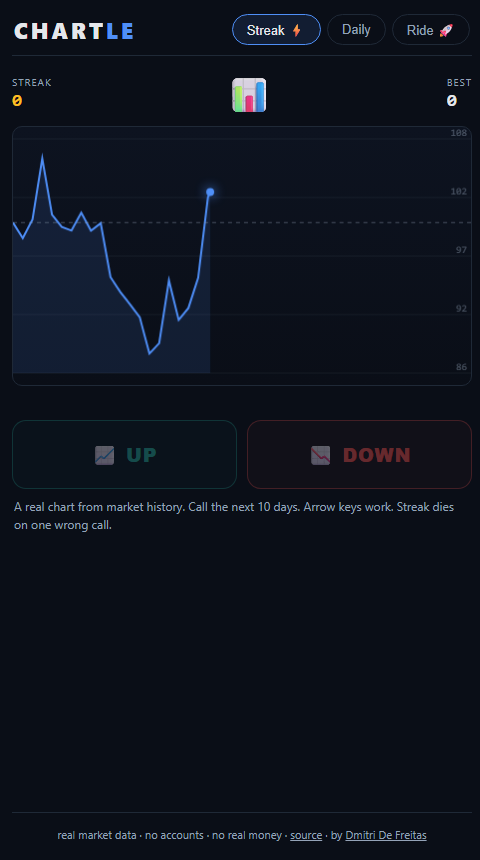
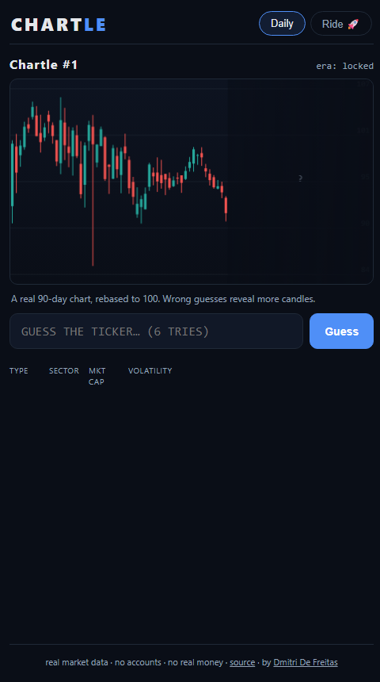
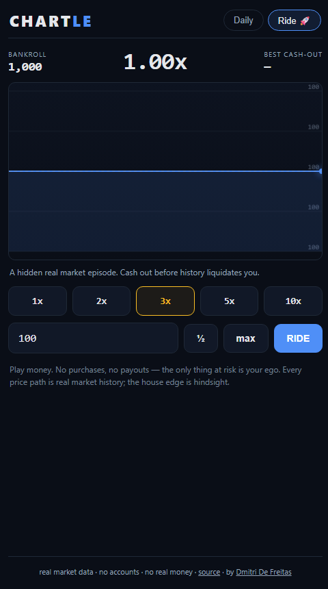

# Chartle 📈

[](https://github.com/dmitridefreitas-dev/chartle/actions/workflows/deploy.yml)
[](LICENSE)

**Play it: https://dmitridefreitas-dev.github.io/chartle/**

A game for market degenerates, built on **real market data**. Three modes,
three dopamine loops:

| **Streak ⚡** — up or down? | **Daily** — guess the chart | **Ride 🚀** — survive the crash |
|---|---|---|
|  |  |  |

## Streak — the one you can't put down

A real chart from market history draws in and freezes. **Call the next 10
days: UP or DOWN.** The future animates in — green flash and your streak
climbs, or red flash and it dies, with the reveal ("that was GME · Jan 2021")
either way. Next chart loads in under a second. Arrow keys work. One wrong
call kills the streak; the share text names the ticker that humbled you.

It feels 50/50. It isn't quite — markets drift up slightly, charts you're
shown skew toward interesting (volatile) history, and momentum is real
sometimes and a trap sometimes. Your lifetime accuracy is tracked. Beating
~55% consistently is genuinely hard, which is the entire lesson of the game,
delivered at Flappy Bird cadence.

## Daily — Wordle for charts (hard mode for the sickos)

Every UTC day, everyone on Earth gets the same real, anonymized 90-day
candlestick chart (rebased to 100 so the price level can't give it away). Six
guesses to name the ticker. Every guess returns structured feedback across four
dimensions — asset **type**, **sector**, **market-cap bucket** (with direction
arrows), **volatility bucket** — and wrong guesses buy you more candles plus an
era hint. Win or lose, you get the story of what you were looking at, and a
spoiler-free emoji grid to paste into the group chat:

```
Chartle #42 3/6 🔥7
⬛🟩⬛🟨
🟩🟩🟨🟩
🟩🟩🟩🟩
```

Streaks, max streaks, win distribution — all stored locally. No accounts, no
server, no tracking: the puzzle is derived deterministically from the date
(a multiplicative permutation over the shuffled puzzle list, so no ticker
repeats until every puzzle has run once).

## Ride — the crash game, honestly sourced

The Aviator/crash mechanic — multiplier climbs, cash out before it dies — but
with one twist that changes everything: **the multiplier is a leveraged
position on a real historical price path.** GameStop January 2021. Bitcoin
2017. The dot-com Nasdaq. The COVID crash. You pick leverage (1x–10x), stake
play-money points, and watch a *hidden* chart replay live. Cash out whenever —
or get liquidated when your leveraged equity hits zero, exactly like a real
margin position. Only then is the ticker revealed.

There is no RNG and no house edge — the house edge is hindsight. Go broke and
you wait for tomorrow's bankroll, or take a bailout (the game counts your
bailouts; the game judges you).

**Play money. No purchases, no payouts, nothing to buy.** It's a lesson about
leverage wearing a slot machine's clothes.

## How it's built

- **TypeScript + Vite, zero runtime dependencies.** Hand-rolled canvas
  renderer for candlesticks and the live ride line (HiDPI-aware, ~17 kB of JS
  total, 6.6 kB gzipped).
- **Real data**: `data/build_dataset.py` pulls ~119 tickers of daily history
  via yfinance, selects each ticker's most *interesting* (high-|return|,
  high-vol) non-overlapping 90-day windows — 357 daily puzzles (~a year of
  content) — plus 24 hand-curated legendary episodes for Ride mode. OHLC is
  normalized to close₀ = 100 at build time; the bundle ships as one static
  JSON.
- **Wordle architecture**: fully static, deployable anywhere, state in
  localStorage. The daily puzzle index is `(day × 2654435761) mod N` — a full
  permutation walk, identical for every player, no backend required.
- **Tested core** (20 Vitest tests): deterministic daily selection and
  full-permutation coverage, guess-feedback scoring incl. ordinal directions,
  share-grid rendering, streak rules across day gaps, Streak-mode round
  slicing/outcome/scoring, and the crash engine — cash-out math, exact
  liquidation threshold, absorbing terminal states, auto-cash at episode end.
- **CI deploys to GitHub Pages** on every push to main (test → build →
  deploy).

## Run it locally

```bash
npm install
npm test          # 16 tests
npm run dev       # vite dev server

# rebuild the dataset (optional — dataset.json is committed)
python data/build_dataset.py
```

## Honesty notes

- Ride mode's leverage model is simplified margin: equity multiplier
  `1 + L·(p/p₀ − 1)`, liquidation at zero — no funding costs, no maintenance
  margin, no slippage. Real leverage is *worse* than this game.
- Daily puzzle metadata (sector, cap, vol buckets) is a curated
  classification, simplified for gameplay (semis get their own sector because
  it makes better puzzles; fight me).
- Charts use adjusted closes; dividends are baked into the path.

## What I'd add next

- Global daily leaderboard + result distribution ("you beat 71% of players") —
  needs the one thing deliberately avoided so far: a tiny backend.
- Hard mode: no era hint, no candle reveals.
- A weekly "guess what happens next" mode: see 60 bars, bet on the next 30.
- More ride episodes (LUNA, FTX-era, 1987) as data sources allow.
